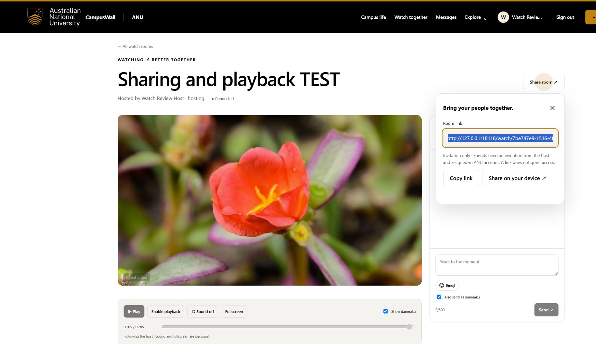
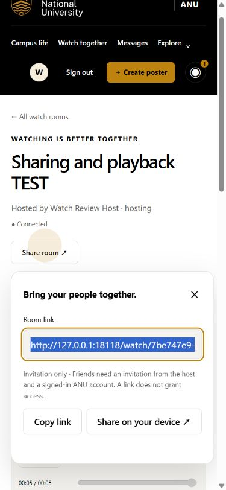
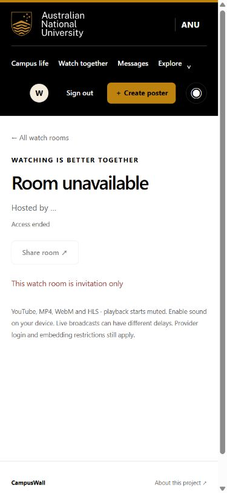

# Watch-room feedback and verification, 3 October 2026

## Report and scope

The student relayed a friend's feedback in the working conversation: room sharing and video playback stutter need attention. This is an English summary of the student's message, not a verbatim English quotation or an observed classroom demonstration. The original browser, provider, network and exact failure steps were not supplied. The student explicitly clarified that the separate term “volting” did not mean voting; its meaning remains unresolved. No voting rule was redesigned on that assumption.

## Problems established by inspection and regression fixtures

Sharing offered clipboard copying with no selectable link when the clipboard was unavailable. Permission failures left the page looking like a room still loading. Playback corrections could seek on non-playback revisions, retry ordinary corrections every timer tick and keep advancing the saved clock while the host buffered. Autoplay denial also allowed repeated automatic attempts. These are independently established implementation defects or failure cases, not a claim to have reproduced the friend's unidentified setup.

The repair in [f8c3ead](https://github.com/comp4020-agentic-coding-studio/comp4020-final-lzm-1024/commit/f8c3eadf4054462b060177ffb98b5223f177d420) adds a share panel with a canonical room URL, manual-copy fallback, optional device sharing and campus/invitation instructions. Access errors appear above a hidden player layout. Host buffering now freezes the durable clock while preserving play intent. Normal viewer corrections need more than four seconds of drift and a five-second cooldown; explicit playback changes can synchronise sooner. Presence/privacy revisions do not force seeks. Browser-denied autoplay waits for a user gesture. HLS enables its worker and bounded buffers; known live playlists avoid VOD-clock seeks.

## Verification

- TypeScript and all **21 top-level checks passed**, in 42.32 seconds against an isolated preview on port 18118. The first full attempt exposed three expected-schema assertions still requiring version 13; they now require version 14. Permission and data-preservation assertions remain in place.
- The final targeted run passed **24 nested Node checks** across [player](../scripts/watch-player.test.mjs), [sharing](../scripts/watch-share.test.mjs) and [server](../scripts/watch.integration.mjs). These counts overlap the full-run wrappers and must not be added to 21. Coverage includes stale revisions, duplicate requests, viewer rejection, buffered restart/resume, manual pause while buffering and autoplay denial.
- Actual browser checks used separate localhost and 127.0.0.1 sessions with disposable ANU accounts. The shared URL redirected an unsigned guest to sign-in and returned to the room afterwards. Clipboard copying reported acceptance. An invitation-only room refused an uninvited guest; after the host invited that account, the same link opened the room and showed two online members. Escape restored focus to Share room.
- A public [MDN CC0 flower clip](https://interactive-examples.mdn.mozilla.net/media/cc0-videos/flower.mp4) played through the room in both sessions. Its duration was 5.055 seconds. At the end, the host was at 5.055 and the guest at approximately 5.047, both paused. This brief transport check does not establish frame-exact synchronisation or long-film stability.
- Layout checks used **1920×1080** and **390×844**. The phone document's client and scroll widths were both 375 pixels; the desktop's were both 1905 pixels. Screenshots document actual local test UI, not production user activity.

## Limits and follow-up

HLS configuration and YouTube state handling have regression coverage, but this run did not benchmark streaming throughput or replay the friend's actual source. The video provider still controls availability, embedding, formats and CORS; user networks and live broadcast delay remain outside the shared clock's guarantees. Device sharing was offered, not sent to an external recipient. No production test accounts, messages or rooms were created. The real Crit 10 instruments-only classmate demonstration remains outstanding.
