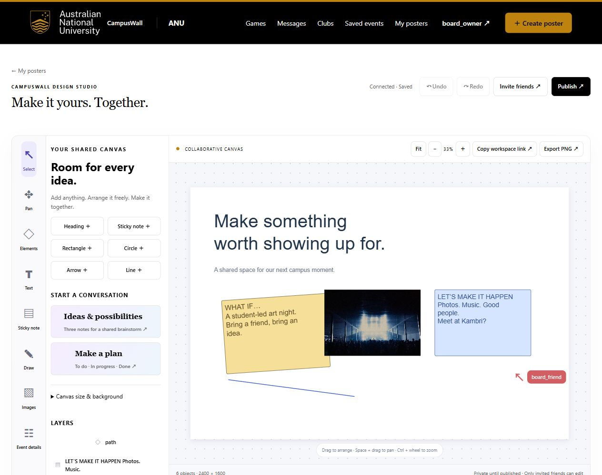
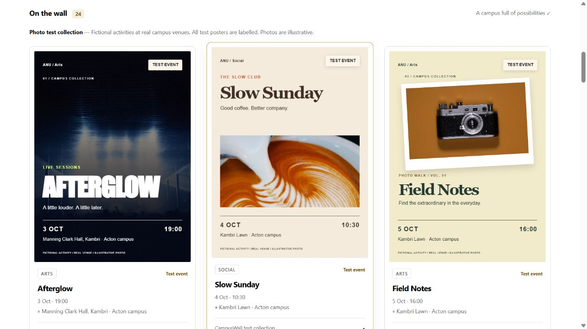
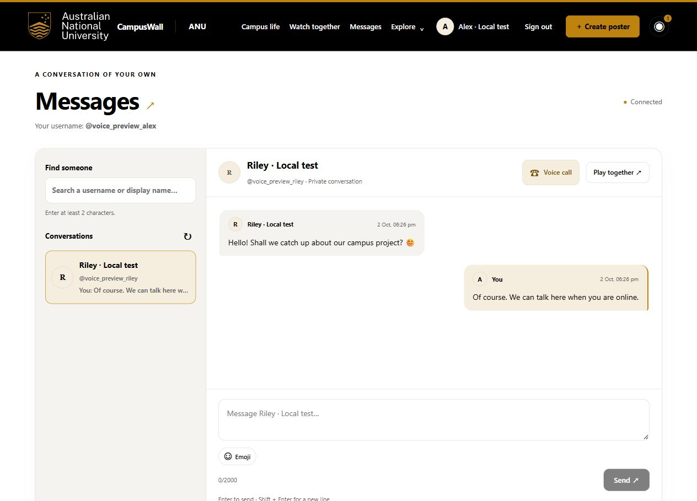
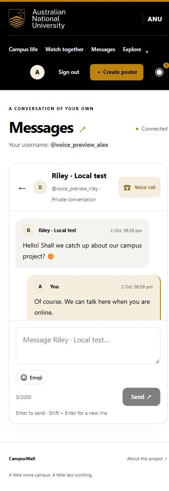
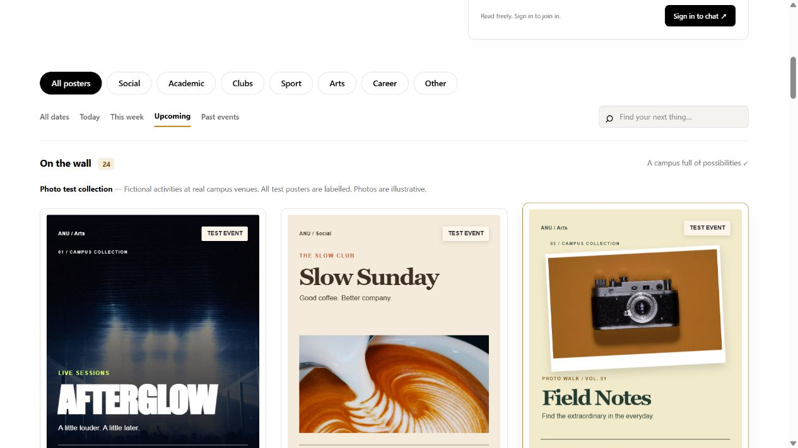

# Verification record and reproduction

## What has actually been checked

On 2 October 2026, the last pre-documentation full run passed TypeScript and **19 top-level Vitest checks**: the two supplied HTTP invariants plus seventeen product wrappers. The wrappers run nested Node test scenarios; counts from earlier development logs use that different level and must not be added to nineteen. The voice wrapper additionally runs real native WebRTC peers with synthetic audio. Final documentation verification results are recorded below after rerunning.

The production smoke from the voice deployment verified eight campus walls/logos/chat channels, 24 photographic TEST notices per campus, 24 local photo files, 1,905 directory entries, ten games and protected APIs. Six deployed frontend files matched tested source hashes. These checks neither create real student activity nor exercise production microphone calls.

| Evidence | What it supports | What it does not establish |
| --- | --- | --- |
| Two authenticated WebSocket clients | Specified live collaboration, access revocation and retry behaviour | Latency on every network or simultaneous campus-wide load |
| Restart fixtures | Saved accepted records survive a process restart | Backup recovery after storage loss |
| Actual native WebRTC with generated sound | Both peers receive decoded non-silent audio through authenticated signalling | Browser microphone permissions or restrictive campus NAT traversal |
| Mocked media-player tests | Host event handling, buffering guards and delayed acknowledgement behaviour | Every provider's playback availability |
| Browser preview and screenshots | Visible controls and observed layout, including a 390 px phone | Unassisted task success, complete accessibility or real adoption |
| Local benchmark | Measured loopback fixture before/after change | Production response-time guarantee or agent productivity |

## Run the application and checks

Use Node.js 24 and pnpm 11. Install with `pnpm install --frozen-lockfile`. In a PowerShell terminal:

```powershell
$env:DATA_DIR = Join-Path (Get-Location) '.local-data'
$env:PORT = '8080'
pnpm start
```

Then, in another terminal:

```powershell
$env:APP_URL = 'http://localhost:8080'
pnpm check
pnpm check:evidence
pnpm docs:check
```

`pnpm check` needs the running app for supplied HTTP invariants. Product scripts create isolated databases and use their own fixed local ports; do not run competing copies of the integration suite concurrently. Some native development dependencies need network access during installation. The native WebRTC fixture has a documented compatibility adapter/exit for its test binding; this binding is not shipped in production. No microphone is accessed by that test.

The original evidence validator checks reflection filenames, harness presence, template removal and resolution of cited hashes. It **does not judge** whether writing is the student's, whether a cited commit supports a claim, or whether future crit work actually occurred. `pnpm docs:check` adds mechanical word-range and local-link checks. Review remains necessary.

For read-only production verification:

```powershell
$env:APP_URL = 'https://comp4020-final-lzm-1024.fly.dev'
pnpm smoke:deploy
```

Do not test real bookings, invitations, room closures or calls by modifying existing production records. Use local fixtures for actions with persistent effects.

## Screenshots and provenance

These are retained screenshots of prior checks, copied into this repository on 2 October 2026. They show local disposable users or published TEST material, not a participant study or additional verification conducted during documentation writing.



The whiteboard image illustrates collaborative controls; the operation/permission assertions are in [whiteboard integration](../scripts/whiteboard.integration.mjs).



The photo wall illustrates demonstration content; venue existence and image attribution are documented in [sources](../data/PHOTO-POSTER-SOURCES.md).





## Human checks still needed

Evaluate 1920×1080 and 390×844 exactly, not merely a similar desktop width. Test keyboard-only navigation, modal focus, reduced motion, real microphone calls and restricted networks with a configured TURN relay. Run uncoached discovery/collaboration tasks with actual students and record failures. The existing browser records do not establish all of these outcomes.

Crit 10 specifically requires structured per-action server logs and an instruments-only demonstration. Current startup/error console output does not meet that requirement. Logs should use opaque IDs and action/outcome classifications, excluding message text, session secrets, email addresses, tickets, video URLs and SDP/ICE.

Documentation deployed: deployment-01M3Y4HB9FA3QB8YWSZREYFRVX, image sha256:9444e0ca86765506ccf28f23c5c3753af58955f535f0468c4397b81dcbb72b8d. Full live README text matches the local document after normal HTML newline normalisation; the production smoke passed. Browser observation confirmed all four section headings and the complete argument at /readme/. Only README is published by the current image; research/process/reflections and the supporting guide remain repository files for student review. No production fixture data was created. The owned local preview and disposable helper/database files were removed.

## Second performance pass, 2 October 2026

TypeScript and all 20 top-level checks passed in 43.85 seconds. The performance wrapper now covers bounded community queries, omission of private draft columns, lazy-service login/logout races, formatter compatibility, published canvas CSS and cancelled wall requests. Existing animation, game, collaborative editor, private chat, watch-player and real synthetic WebRTC checks also passed. See [performance evidence](../data/PERFORMANCE.md) for precise fixture measurements, unchanged-response assertions and the absence of a claimed HTTP latency improvement. Browser checks used one disposable local account and private board; production records were not used for write tests.

Deployed as `deployment-01M3Y8XT8BCM7ERXGZAC0MNHQG`, image `sha256:c61242e8b8e1cebd5b370c83c28767e32f2335d9db4c4cf797bf8dfc5788b957`. The read-only production smoke passed, and six changed public modules/stylesheets matched their local SHA-256 hashes. Live browser observation confirmed 24 ANU photo cards, an active read-only guest chat and deferred editor CSS. The temporary local preview and fixture database were removed. This screenshot records production appearance after deployment; it is not evidence of a whole-page loading-time gain.


